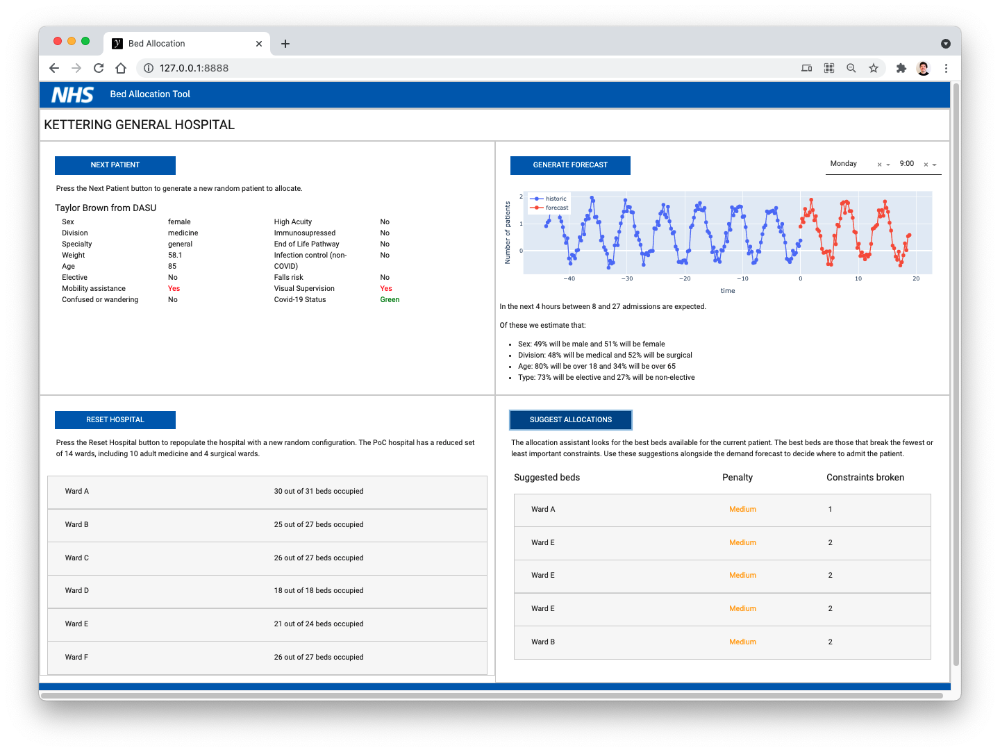
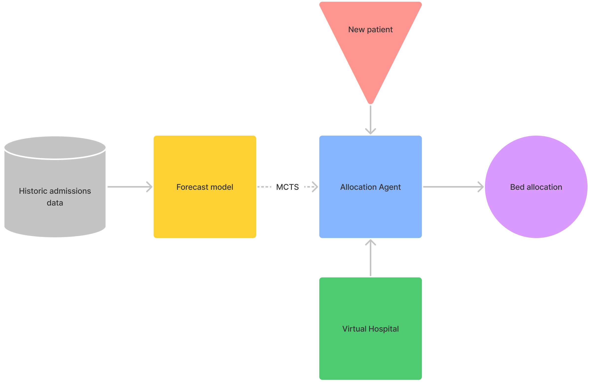

[](https://github.com/GIScience/badges#experimental)
[](LICENSE)


# NHS AI Lab Skunkworks project: Bed Allocation

> A pilot project for the NHS AI (Artificial Intelligence) Lab Skunkworks team, Bed Allocation aims to explore whether machine learning can effectively aid bed management in Kettering General Hospital.

Bed allocation was identified as a suitable opportunity for the AI Skunkworks programme in May 2021.



## Intended Use

This proof of concept ([TRL 4](https://en.wikipedia.org/wiki/Technology_readiness_level)) is intended to demonstrate different approaches to forecasting and bed allocation using machine learning. It is not intended for deployment in a clinical or non-clinical setting without further development and compliance with the [UK Medical Device Regulations 2002](https://www.legislation.gov.uk/uksi/2002/618/contents/made) where the product qualifies as a medical device.

## Background

The NHS AI Lab Skunkworks team and the Kettering General Hospital NHS Foundation Trust (KGH) commissioned a 12-week project via the Accelerated Capability Environment (ACE) to test whether Machine Learning (ML) can assist with bed allocation.

Faculty, an applied AI company, was engaged 
to collaborate closely with KGH to develop a Proof of Concept (PoC) to demonstrate how artificial intelligence (AI) could be used to enable both site managers and less experienced staff members to allocate and optimise patient movement and safety within the hospital. 

## Data Protection

This project was subject to a Data Protection Impact Assessment (DPIA), ensuring the protection of the data used in line with the [UK Data Protection Act 2018](https://www.legislation.gov.uk/ukpga/2018/12/contents/enacted) and [UK GDPR](https://ico.org.uk/for-organisations/dp-at-the-end-of-the-transition-period/data-protection-and-the-eu-in-detail/the-uk-gdpr/). No data or trained models are shared in this repository.

## Overview

> The full [technical report (PDF)](docs/NHS_AI_Lab_Skunkworks_Bed_Allocation_Technical_Report.pdf) is available to download.

This project consists of 5 components:

Component|Description|Documentation
---|---|---
Virtual Hospital|Defines a hospital with wards and beds|[`src/hospital`](src/hospital)
Allocation Agent|Allocates a new patient based on the virtual hospital environment and constraints|[`src/agent`](src/agent)
Demand Forecast|Generates a forecast for bed demand based on historical data|[`src/forecasting`](src/forecasting)
Fake data generation|Generates fake data to test the setup and running of the repo|[`fake_data_generation/`](fake_data_generation)
UI|A web-based frontend built with Plotly Dash that integrates the virtual hospital, allocation and demand forecast components|`app`

Using historical admissions data, the forecast model feeds into the allocation agent (for Monte Carlo Tree Search) and suggests the best available bed for an incoming patient:



## Known limitations

* The greedy allocation agent is the only agent integrated into the UI due to performance issues with the MCTS approach
* Several characteristics of the virtual hospital are hardcoded into this prototype
* This tool has been tested on macOS only

## Getting Started

This project requires Python 3.9+.

### Installation

1. Create a virtual environment using e.g. [venv](https://docs.python.org/3/library/venv.html)
2. For standard installation run `pip install .` from within the repo.
3. To install in development mode with the [Pytest](https://docs.pytest.org/en/6.2.x/) testing suite available run
```pip install -e ."[testing]"```.

### Generating required data artefacts

The user interface integrates the greedy allocation approach, which is independent of the time series forecast, as well as a visual forecast of upcoming patients.

There are two ways to generate the required data artefacts before launching the UI:

#### 1. Using fake data

This repository includes a [fake data generator](fake_data_generation/) and [integration test](tests/integration) which will run an end-to-end build of the required data artefacts as well as launch the UI.

To run the [integration test](tests/integration), install the tool in **development mode** (`pip install -e ."[testing]"`) and from the main project directory run:

```bash
cd tests/integration
./integration_test.sh
```

and follow the instructions.

#### 2. Using your own data

If you'd like to use your own data, please get in touch with us for support: ai-skunkworks@nhsx.nhs.uk

### Launching the user interface

With the required artefacts in place, to launch the UI from your virtual environment, run `python app/run.py` which will listen on port 8888.

## NHS AI Lab Skunkworks

The project is supported by the NHS AI Lab Skunkworks, which exists within the NHS AI Lab at NHSX to support the health and care community to rapidly progress ideas from the conceptual stage to a proof of concept.

Find out more about the [NHS AI Lab Skunkworks](https://www.nhsx.nhs.uk/ai-lab/ai-lab-programmes/skunkworks/).
Join our [Virtual Hub](https://future.nhs.uk/connect.ti/system/text/register) to hear more about future problem-sourcing event opportunities.
Get in touch with the Skunkworks team at [aiskunkworks@nhsx.nhs.uk](aiskunkworks@nhsx.nhs.uk).

## Licence

Unless stated otherwise, the codebase is released under [the MIT Licence][mit].
This covers both the codebase and any sample code in the documentation.

The documentation is [© Crown copyright][copyright] and available under the terms
of the [Open Government 3.0][ogl] licence.

[mit]: LICENCE
[copyright]: http://www.nationalarchives.gov.uk/information-management/re-using-public-sector-information/uk-government-licensing-framework/crown-copyright/
[ogl]: http://www.nationalarchives.gov.uk/doc/open-government-licence/version/3/
