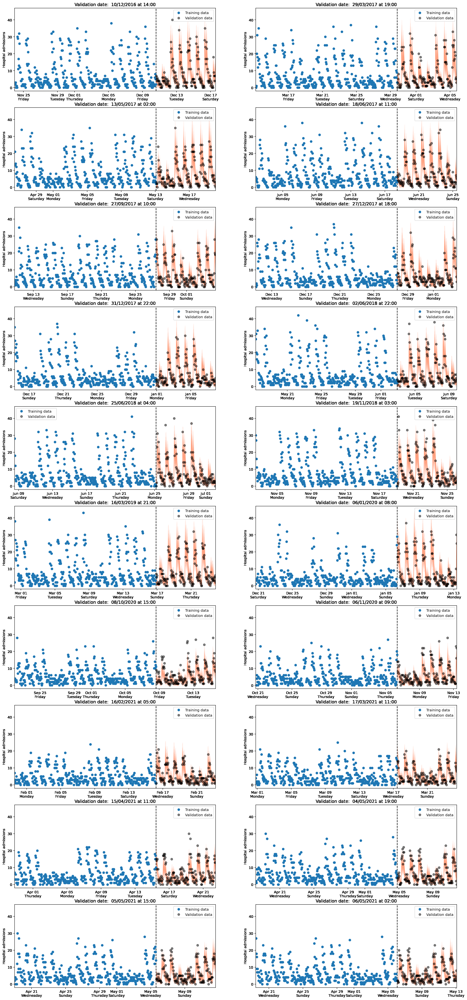
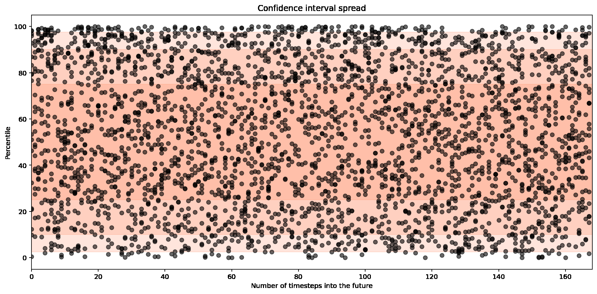
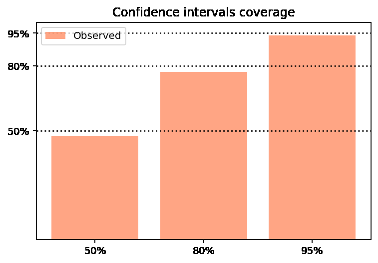

# Time Series Forecasting

## 1. Introduction

In order to inform the bed allocation process we developed a demand predictor to forecast the number of patients due to be admitted into the hospital. We adopted a Bayesian modelling approach using numpryo and jax. The fundamental idea behind this approach is that the model itself is considered to be a statistical object. In particular, the model parameters that define the model are interpreted as being drawn from a distribution defined using Bayes’ Theorem. The output to the model is then a full posterior distribution for the predicted number of admissions rather than a single number. This allows us to draw samples for the predicted number of admissions and generate confidence intervals over our estimates.

The admissions forecast model consisted of four components which account for: 
- The long term trend: to account for variations such as the current rise in admissions after the downturn during COVID-19 lockdowns; 
- The day of the week: to account for variations connected with specific days in the week, e.g. admissions are typically lower on the weekends; 
- The hour of the day: to account for variations connected with the time of day, e.g. fewer patients are admitted at night than during the day; 
- Whether it is a bank holiday: to account for variations that are due to these specific dates, e.g. fewer patients are admitted on bank holidays.

We captured the long term trend in the historic admissions data using a Gaussian Process (GP), inspired by previous work of Vehtari et al., as summarised in this [blog post](https://avehtari.github.io/casestudies/Birthdays/birthdays.html#Model_3:_Slow_trend_+_yearly_seasonal_trend_+_day_of_week). A GP does not constrain the model to take on any particular form. Instead, it returns a distribution over the functions which are consistent with the observed data, in this case, the historic admissions timeseries. In practice, exact GPs can be inefficient to calculate, we therefore utilised the Hilbert Space approximation based on [this numpyro tutorial](http://num.pyro.ai/en/latest/examples/hsgp.html) to ensure tractable runtimes.

## 2. Building the forecast model

### 2.1 Import required modules

```python
import os
import pickle

from forecasting.forecast import PatientForecast
from forecasting.utils import (
    FORECAST_HOURS, # 24
    HISTORIC_HOURS, # 168 
    HOURS_IN_WEEK, # 168 
    START_FORECAST, # 21/06/2021 00:00
)
```

### 2.2 Initialise forecast class

```python
# Initialise class
forecast_model = PatientForecast()
```

### 2.3 Train model

We trained the model on previous admissions data, aggregated to show the total number of admissions (medical and surgical) every hour for the past 120 days. We chose this as our training period because it allows enough time for both the short and long term trends to show up within the data, whilst reducing the effect of the abnormalities in admission caused by COVID-19. Once the model has been trained, we can then use it to predict the number of patients that will be admitted each hour. Rather than a single number, the demand predictor produces a posterior distribution, meaning we can draw samples for the predicted number of patient admissions. We can also use the posterior to generate confidence intervals for our model. Here we use the 95% confidence interval, which means that 95 times out of 100 we expect the patient admission numbers to fall within the range provided.

```python
# Train model, with training period ending at START_FORECAST
forecast_model.train_model(START_FORECAST, training_hours=2880)
```

### 2.4 Generate predictions

```python
 # Get prediction for 1 week before START_FORECAST and 24hrs after a week after START_FORECAST
results = forecast_model.call_forecast(
    START_FORECAST,
    historic_hours=HISTORIC_HOURS,
    forecast_hours=HOURS_IN_WEEK + FORECAST_HOURS,
)
```

### 2.5 Save results

```python
# results are then saved as forecast_results.pkl
pickle.dump(results, open("../data/forecast_results.pkl", "wb"))
```

## 3. Validating the forecast model

In order to check the performance of the demand predictor, we need to validate the predictions against historic admissions data. We can do this by training the model on historic patient admis- sions data, for example on the 120 days between 01/01/2021 and 30/04/2021. We then generate a forecast for the next 7 days, in this example between 01/05/2021 and 07/05/2021, and compare it to historic data from that time period. We can look at where the admitted number of patients for each hour lies compared to different confidence intervals and check that the correct amount of historic data lies within each confidence interval, for example 50% of the actual patients that arrived should fall within the 50% confidence interval predicted by the model.

### 3.1 Import required modules

```python
import os
import numpy as np
import pandas as pd
import matplotlib.pyplot as plt
import matplotlib.dates as mdates
import jax
import jax.numpy as jnp
import numpyro
from jax import random
from numpyro.infer import MCMC, NUTS, Predictive, init_to_median from collections import defaultdict
from scipy.stats import percentileofscore
from sklearn.metrics import mean_absolute_error as mae
from forecasting.time_series_model import gp
from forecasting.forecast import UnivariateScaler
from forecasting.utils import load_timeseries, load_holidays 
from forecasting.plotting import ribbon_plot
```

### 3.2 Configure parameters

```python
NUM_CPUS = int(os.environ.get("NUM_CPUS", os.cpu_count()))
numpyro.set_host_device_count(NUM_CPUS)

# Set a random seed
rng_key = random.PRNGKey(42)

# Load holiday data
HOLIDAYS = load_holidays()
```

### 3.3 Define validation model

```python
 # Validation class
class Validation:
    COVID_START_DATE = pd.to_datetime("2020-Mar-20")

    def __init__(self, mcmc, training_hours=2880, forecast_hours=168):
        self.training_hours = training_hours
        self.forecast_hours = forecast_hours
        self.timeseries = load_timeseries()
        self.mcmc = mcmc
        # These are instantiated at training time 
        self.x_scaler = None
        self.L = None
        self.training_start_date = None

    def run(self, rng_key, dates):
        subkeys = jax.random.split(rng_key, num=len(dates)) results = {}
        for key, date in zip(subkeys, dates):
            y_train, y_test = self.split(date)
            training_data = self.prepare_data_dictionary(y_train, is_training=True)
            forecast_data = self.prepare_data_dictionary(y_test, is_training=False)
            self.mcmc.run(key, **training_data)
            prediction = self.predict(key, **forecast_data)
            results[date] = (y_test, prediction, mcmc.get_samples())
        return results

    def predict(self, rng_key, *args, **kwargs):
        predictive = Predictive(self.mcmc.sampler.model, posterior_samples=self.mcmc.get_samples())
        prediction = predictive(rng_key, *args, **kwargs)
        return prediction["y"]

    def split(self, date, validate=True):
        self._validate_split_date(date)
        past_datetimes = self.timeseries.loc[:date].index
        future_datetimes = self.timeseries.index.difference(past_datetimes) training_datetimes = past_datetimes[-self.training_hours:] forecast_datetimes = future_datetimes[:self.forecast_hours]
        y_train = self.timeseries.loc[training_datetimes]
        y_test = self.timeseries.loc[forecast_datetimes]
        return y_train, y_test

    def prepare_data_dictionary(self, y, is_training=True): 
        if is_training:
            # Reset the scaler in each training, re-use if validating
            self.x_scaler = UnivariateScaler()
            self.training_start_date = y.index.min()
        
        x = (y.index - self.training_start_date) / pd.Timedelta("1H")
        xsd = self.x_scaler.fit_transform(x)
        
        if is_training:
            self.L = 1.5 * max(xsd)
        
        day_of_week = y.index.day_of_week
        hour_of_day = y.index.hour
        is_holiday = [d.date() in HOLIDAYS.date for d in y.index]
        return {
            "y": jnp.array(y.values) if is_training else None, 
            "x": jnp.array(xsd),
            "day_of_week": jnp.array(day_of_week), 
            "hour_of_day": jnp.array(hour_of_day), 
            "is_holiday": jnp.array(is_holiday),
            "L": self.L,
            "M": 10,
        }

    def _validate_split_date(self, date): 
    """
    Do not split if Covid is very recently in the past or in the very near future. """
        if date >= self.COVID_START_DATE:
            dt_past = (date - self.COVID_START_DATE) / pd.Timedelta("1H")
            dt_future = (self.timeseries.index.max() - date) / pd.Timedelta("1H")
        
            msg1 = (
            f"At least {self.training_hours} training hours are required" f" but it's only been {dt_past} hours since Covid started"
            )
            msg2 = (
            f"At least {self.forecast_hours} validation hours are required" f" but there's only {dt_future} hours left in the future."
            )
            assert (dt_past > self.training_hours), msg1 
            assert (dt_future > self.forecast_hours), msg2
        else:
            dt_future = (self.COVID_START_DATE - date) / pd.Timedelta("1H") dt_past = (date - self.timeseries.index.min()) / pd.Timedelta("1H") msg1 = (
                f"At least {self.forecast_hours} validation hours are required"
                f" but there's only {dt_future} hours until Covid starts." )
            msg2 = (
                f"At least {self.training_hours} training hours are required" 
                f" but it's only been {dt_past} hours since data collection started" )
            assert (dt_future > self.forecast_hours), msg1 
            assert (dt_past > self.training_hours), msg2
```

### 3.4 Initialise model

```python
mcmc = MCMC(NUTS(gp, init_strategy=init_to_median), num_warmup=2000,num_samples=2000, num_chains=4)

# Initalise class instance
cv = Validation(mcmc)
```

### 3.5 Select validation dates

We chose 20 random dates during the period that we have data for (01/07/2016 - 01/07/2021) to perform validation on. For each of these 20 dates, we checked that there was sufficient data before that date to train the model (120 days) and sufficient data after that date to validate the model (7 days). We also checked for each of the dates the training and validation periods did not overlap with the start of the COVID-19 pandemic (defined for this purpose as 20/03/2020). The reason that we did not extensively test this model’s performance over the pandemic period is that this model was not designed to predict the sudden drop in planned admissions and rise of COVID-19 admissions caused by the pandemic. For modelling admissions during COVID-19 a different functional form is recommended, such as the epidemiologically inspired approach adopted in the Early Warning System.

```python
 # Select 20 random dates to perform validation
selected_dates = pd.to_datetime(sorted(np.random.choice(cv.timeseries.index,size=20, replace=False)))
selected_dates = list(selected_dates)
selected_dates
```

```python
# Test if any of these dates are too close to start of COVID
validation_dates = []
for date in selected_dates:
    try: 
        cv.split(date)
    except AssertionError: 
        print(f"skipping {date}") continue
    else: 
        validation_dates.append(date)

validation_dates
```

### 3.6 Run validation

```python
# Set random key generator
cv_rng_key = jax.random.PRNGKey(1)
```

```python
 # Run validation
result = cv.run(cv_rng_key, validation_dates)
```

### 3.7 Plot forecast for validation dates

The figure below shows the validation plots on different dates, with the date for each plot given in the title and shown in the plot as a black dashed line. In each of these plots, the blue points show a subset of the 120 days worth of training data before each date, and the grey points are 7 days worth of validation data after each date, with the training and validation data both having come from the data provided to us by KGH. The coral bands then show the 95% confidence intervals for the model. The day of the week and hour of the day effects are evident within these plots, as you can see the drop in admissions on weekends and during the night. The effect of the long term trend is also evident, as the forecast reflects the drop in admissions after COVID compared to before.

```python
 # Plot forecast with validation data for each date
ax_date_format = mdates.DateFormatter('%b %d\n%A')
f, axes = plt.subplots(len(validation_dates) // 2, 2, figsize=(22,len(validation_dates) * 5 // 2))
for ax, date in zip(axes.flatten(), validation_dates):
    y_train, _ = cv.split(date, validate=False)
    y, forecast, _ = result[date]
    ax.plot(y_train.iloc[-400:], marker='o', lw=0, label='Training data') 
    ax.plot(y, marker='o', lw=0, color='k', alpha=0.5, label='Validation data') 
    ax.vlines(date, -2, 47, color='black', linestyles='dashed') 
    ribbon_plot(y.index, forecast, plot_median=False, ax=ax,ribbon_color='coral')
    ax.xaxis.set_major_formatter(ax_date_format) 
    ax.set_title(f"Validation date: {date: %d/%m/%Y at %H:%M}") 
    ax.legend()
    ax.set_ylim([-2, 47])
    ax.set_xlim([min(y_train.iloc[-400:].index), max(y.index)]) 
    ax.set_ylabel("Hospital admissions")
```



### 3.8 Model calibration

To get a measure of how well our model is performing, we can generate plots to show where the validation data points land relative to the confidence intervals from the forecast, such as the one in the figure below. For example, if a validation data point was right in the centre of the forecast band it would be placed on percentile 50 in this plot. The x axis then shows the time in hours between the validation data point and the date the validation was performed on. For a perfect model, 50% of the points would lie within the darkest coral band, 80% within the next band and then 95% within the lightest band. The figure at the bottom shows the results of this test - 48%, 78% and 94% of the validation points fall within the 50%, 80% and 95% confidence intervals respectively. In summary, the results of these tests show that our demand predictor is incredibly accurate and provides the users with a reliable indication of incoming patient demand.

```python
 # Find where each validation data point lies compared to percentiles from forecast
percentiles = defaultdict(list)
for y, forecast, _ in result.values(): for n, val in enumerate(y.values):
        percentiles[n].append(percentileofscore(forecast[:, n], val))
```

```python
 # Plots validation data points together compared to which percentile they on
plt.figure(figsize=(15, 7))
for n, ps in percentiles.items():
    plt.plot([n] * len(ps), ps, marker='o', lw=0, color='k', alpha=0.6)
plt.axhspan(2.5, 97.5, alpha=0.2, color='coral')
plt.axhspan(10, 90, alpha=0.2, color='coral')
plt.axhspan(25, 75, alpha=0.2, color='coral')
plt.title("Confidence interval spread")
plt.xlabel("Number of timesteps into the future")
plt.ylabel("Percentile")
plt.xlim([0, 168])
plt.show()
```



```python
 # For each calibration data points, checks whether it is within the 50%, 80% and 95% confidence intervals
calibration = {50: [], 80: [], 95: []} 
for n, ps in percentiles.items():
    calibration[50].extend([25 <= val <= 75 for val in ps])
    calibration[80].extend([10 <= val <= 90 for val in ps])
    calibration[95].extend([2.5 <= val <= 97.5 for val in ps])
```

```python
 # Percentage of validation data points within 50%, 80% and 95% confidence intervals respectively
sum(calibration[50]) / len(calibration[50]), sum(calibration[80]) / len(calibration[80]), sum(calibration[95]) / len(calibration[95])
```

```python
 # Plots amount of validation data points within 50%, 80% and 95% confidence intervals
plt.title("Confidence intervals coverage")
plt.bar([1, 2, 3], [np.mean(c) for c in calibration.values()], label='Observed', color='coral', alpha=0.7) 
plt.xticks([1, 2, 3], ["50%", "80%", "95%"]) 
plt.yticks([0.50, 0.80, 0.95], ["50%", "80%", "95%"]) 
for p in [50, 80, 95]:
    plt.axhline(y=p/100, linestyle=':', color='k', alpha=0.8)
plt.ylim([0, 1])
plt.legend()
plt.show()
```

